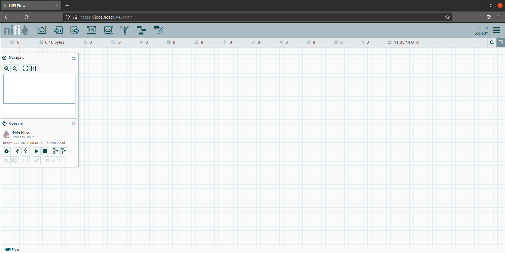

# [Apache NiFiの環境設定](https://avinton.com/academy/apache-nifi-preferences/)
## Prerequisite
- [Docker EngineのUbuntu上へのinstall](https://avinton.com/academy/installing-docker-engine-on-ubuntu/)
```
# Uninstall old versions
sudo apt-get remove docker docker-engine docker.io containerd runc

# Set up the repository
sudo apt-get update
sudo apt-get install ca-certificates curl gnupg lsb-release
sudo mkdir -p /etc/apt/keyrings
curl -fsSL https://download.docker.com/linux/ubuntu/gpg | sudo gpg --dearmor -o /etc/apt/keyrings/docker.gpg
echo "deb [arch=$(dpkg --print-architecture) signed-by=/etc/apt/keyrings/docker.gpg] https://download.docker.com/linux/ubuntu $(lsb_release -cs) stable" | sudo tee /etc/apt/sources.list.d/docker.list > /dev/null sudo tee /etc/apt/sources.list.d/docker.list > /dev/null

# Install Docker Engine
sudo apt-get update
sudo apt-get install docker-ce docker-ce-cli containerd.io docker-compose-plugin

# Verify that Docker Engine is installed correctly
sudo docker run --rm hello-world

# Manage Docker as a non-root user
sudo groupadd docker
sudo usermod -aG docker $USER
newgrp docker 
```

## Procedure
```
# Running a container
docker run --name nifi -p 8443:8443 -d -v ~/ApacheNiFi/:/nifi/work/ -e SINGLE_USER_CREDENTIALS_USERNAME=admin -e SINGLE_USER_CREDENTIALS_PASSWORD=ctsBtRBKHRAx69EqUghvvgEvjnaLjFEB apache/nifi:latest

# Preparation
mkdir -p ApacheNiFi/input
mkdir -p ApacheNiFi/output
touch ApacheNiFi/input/test.csv

# @https://localhost:8443/nifi/login
User: admin
Password: ctsBtRBKHRAx69EqUghvvgEvjnaLjFEB
```



## Review
- The installation of the Docker Engine was referred to the [official version](https://docs.docker.com/engine/install/ubuntu/) just in case.
- Similarly. [Manage Docker as a non-root user](https://docs.docker.com/engine/install/linux-postinstall/)
- Similarly. [ApacheNifi Docker Image Quickstart](https://hub.docker.com/r/apache/nifi/)

# [Apache NiFi データパイプライン基礎](https://avinton.com/academy/apache-nifi-data-pipeline-basics/)

## Procedure
```
# Create Processors
- ListFile (Input Directory: /nifi/work/input)
- FetchFile
- PutFile (Output Directory: /nifi/work/output)
```


## Review
- FetchFile and PutFile required the following settings.


# [Apache NiFi Exercise](https://avinton.com/academy/apache-nifi-exercise/)
```
# Download Images
# Create Directories
mkdir -p ApacheNiFi/input/images
mkdir -p ApacheNiFi/output/images/png
mkdir -p ApacheNiFi/output/images/jpg
mkdir -p ApacheNiFi/output/images/large_images
```


## Review
- Reference  
> [1] [Syncfusion](https://help.syncfusion.com/data-integration/processors/routeonattribute)  
> [2] [ApacheNiFi](https://nifi.apache.org/docs/nifi-docs/html/expression-language-guide.html)

- It took me a while to find the article to which you refer.