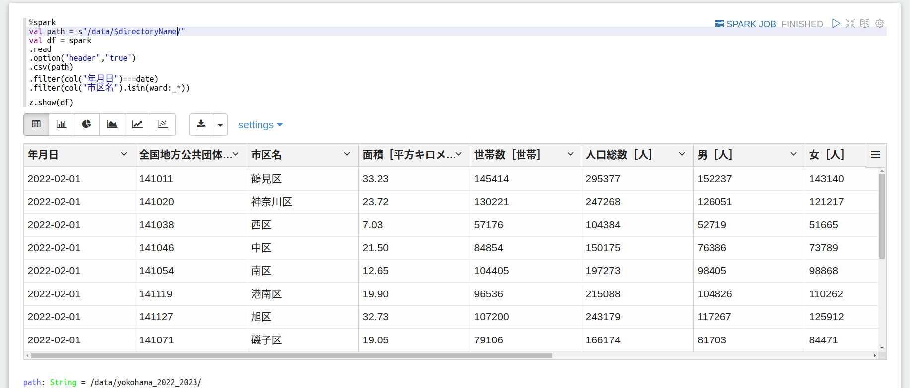
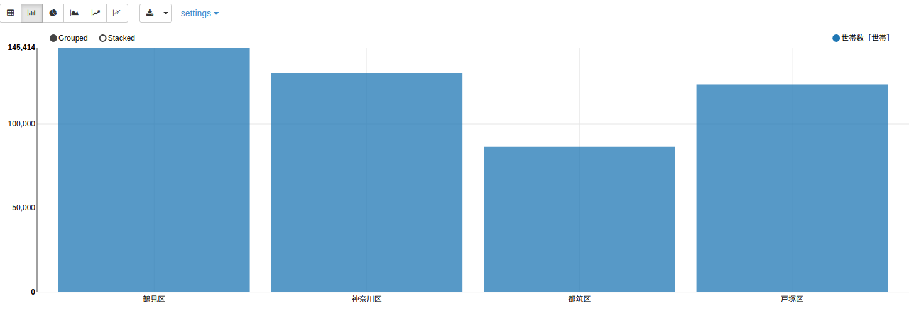

# [Apache Zeppelin 基本機能](https://avinton.com/academy/apache-zeppelin-basic-features/)
## Prerequisite
- [Apache SparkとApache Zeppelinの概要と環境構築](../EnvironmentBuilding/note.md)

## Procedure
- Download sample data
```
cd ~/zeppelin/data
curl -LO https://avinton.com/wp-content/uploads/2022/04/yokohama2202.csv
curl -LO https://avinton.com/wp-content/uploads/2022/04/yokohama2203.csv
```
- Union the two data and then save them.
```
# @Zeppelin <AvintonAcademy.zpln>
%spark
val df2202 = spark
.read
.option("header","true")
.csv("/data/yokohama2202.csv")

val df2203 = spark
.read
.option("header","true")
.csv("/data/yokohama2203.csv")

val df = df2202
.union(df2203)

df
.write
.mode("overwrite")
.option("header", "true")
.csv("/data/yokohama_2022_2023/")

# result
df2202: org.apache.spark.sql.DataFrame = [年月日: string, 全国地方公共団体コード: string ... 10 more fields]
df2203: org.apache.spark.sql.DataFrame = [年月日: string, 全国地方公共団体コード: string ... 10 more fields]
df: org.apache.spark.sql.Dataset[org.apache.spark.sql.Row] = [年月日: string, 全国地方公共団体コード: string ... 10 more fields]
```

- Preparing to use Cron Schedular
```
# <~/zeppelin/conf/zeppelin-site.xml>
<!--?xml version="1.0"?-->
<!--?xml-stylesheet type="text/xsl" href="configuration.xsl"?-->
 
 
  zeppelin.notebook.cron.enable
  true
  Notebook enable cron scheduler feature
 
 
 
  zeppelin.notebook.cron.folders
  /
  Notebook cron folders

# command
docker container cp zeppelin-site.xml zeppelin:/opt/zeppelin/conf/zeppelin-site.xml
docker restart zeppelin
```
- Practice basic functions
```
# @Zeppelin <AvintonAcademy.zpln>
## command
%spark
val directoryName = z.textbox("directory").toString

## result
directoryName: String = yokohama_2022_2023

## command
%spark
val date = z.select("date", Seq(("2022-02-01", "2022-02-01"), ("2022-03-01", "2022-03-01"))).toString

## result
date: String = 2022-02-01

## command
%spark
val options = Seq(
  ("鶴見区","鶴見区"), 
  ("神奈川区","神奈川区"), 
  ("中区","中区"),
  ("西区","西区"),
  ("南区","南区"),
  ("西区","西区"),
  ("港南区","港南区"),
  ("保土ケ谷区","保土ケ谷区"),
  ("旭区","旭区"),
  ("磯子区","磯子区"),
  ("金沢区","金沢区"),
  ("港北区","港北区"),
  ("緑区","緑区"),
  ("都筑区","都筑区"),
  ("戸塚区","戸塚区"),
  ("栄区","栄区"),
  ("泉区","泉区"),
  ("瀬谷区","瀬谷区")
)
val ward = z.checkbox("ward", options).toList

## result
options: Seq[(String, String)] = List((鶴見区,鶴見区), (神奈川区,神奈川区), (中区,中区), (西区,西区), (南区,南区), (西区,西区), (港南区,港南区), (保土ヶ谷区,保土ヶ谷区), (旭区,旭区), (磯子区,磯子区), (金沢区,金沢区), (港北区,港北区), (緑区,緑区), (都筑区,都筑区), (戸塚区,戸塚区), (栄区,栄区), (泉区,泉区), (瀬谷区,瀬谷区))
ward: List[Any] = List(鶴見区, 神奈川区, 中区, 西区, 南区, 西区, 港南区, 保土ヶ谷区, 旭区, 磯子区, 金沢区, 港北区, 緑区, 都筑区, 戸塚区, 栄区, 泉区, 瀬谷区)

## command
%spark
val path = s"/data/$directoryName/" 
val df = spark
.read
.option("header","true")
.csv(path)
.filter(col("年月日")===date)
.filter(col("市区名").isin(ward:_*)) 

z.show(df)
```




```
# Cron Scheduler
## Runs every minute
0 0/1 * * * ?

## Execute at any time
0 30 4 22 8 ? 
```
## Review
- Corrected the contents of [zeppelin-site.xml](src/zeppelin-site.xml).
- Note that Zeppelin's CronScheduler references UTC,  
  as well as notations for "seconds, minutes, hours, days, months ?"