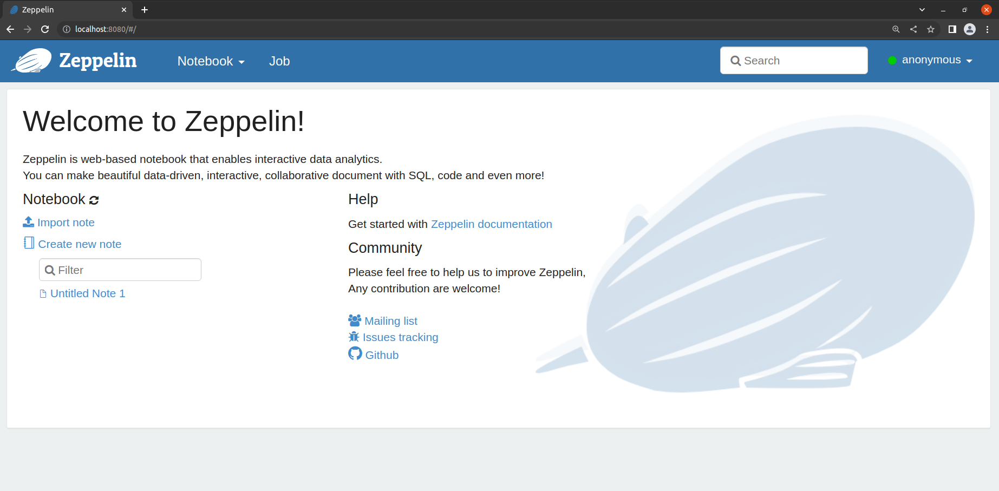

# [Apache SparkとApache Zeppelinの概要と環境構築](https://avinton.com/academy/apache-spark-zeppelin-environment-setup/)
## Prerequisite
- [Docker EngineのUbuntu上へのinstall](https://avinton.com/academy/installing-docker-engine-on-ubuntu/)

## Procedure
- Launch Apache Zeppelin in a container ([Zeppelin](https://zeppelin.apache.org/docs/0.9.0/quickstart/install.html#using-the-official-docker-image))
```
mkdir -p ~/zeppelin/logs ~/zeppelin/notebook ~/zeppelin/data
docker run -p 8080:8080 -d \
           -v ~/zeppelin/logs:/logs \
           -v ~/zeppelin/notebook:/notebook \
           -v ~/zeppelin/data:/data \
           -e ZEPPELIN_LOG_DIR='/logs' -e ZEPPELIN_NOTEBOOK_DIR='/notebook' \
           --name zeppelin apache/zeppelin:0.9.0
```
