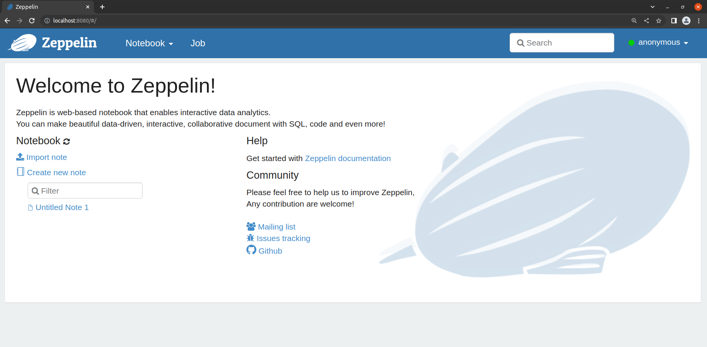
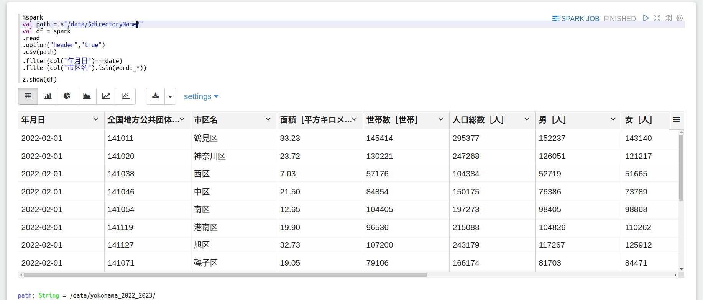
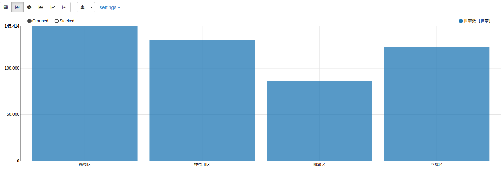

# [Apache SparkとApache Zeppelinの概要と環境構築](https://avinton.com/academy/apache-spark-zeppelin-environment-setup/)
## Prerequisite
- [Docker EngineのUbuntu上へのinstall](https://avinton.com/academy/installing-docker-engine-on-ubuntu/)

## Procedure
- Launch Apache Zeppelin in a container ([Zeppelin](https://zeppelin.apache.org/docs/0.9.0/quickstart/install.html#using-the-official-docker-image))
```
mkdir -p ~/zeppelin/logs ~/zeppelin/notebook ~/zeppelin/data
docker run -p 8080:8080 -d \
           -v ~/zeppelin/logs:/logs \
           -v ~/zeppelin/notebook:/notebook \
           -v ~/zeppelin/data:/data \
           -e ZEPPELIN_LOG_DIR='/logs' -e ZEPPELIN_NOTEBOOK_DIR='/notebook' \
           --name zeppelin apache/zeppelin:0.9.0
```


# [Apache Zeppelin 基本機能](https://avinton.com/academy/apache-zeppelin-basic-features/)
## Prerequisite
- [Apache SparkとApache Zeppelinの概要と環境構築](#apache-sparkとapache-zeppelinの概要と環境構築)

## Procedure
- Download sample data
```
cd ~/zeppelin/data
curl -LO https://avinton.com/wp-content/uploads/2022/04/yokohama2202.csv
curl -LO https://avinton.com/wp-content/uploads/2022/04/yokohama2203.csv
```
- Union the two data and then save them.
```
# @Zeppelin <AvintonAcademy.zpln>
%spark
val df2202 = spark
.read
.option("header","true")
.csv("/data/yokohama2202.csv")

val df2203 = spark
.read
.option("header","true")
.csv("/data/yokohama2203.csv")

val df = df2202
.union(df2203)

df
.write
.mode("overwrite")
.option("header", "true")
.csv("/data/yokohama_2022_2023/")

# result
df2202: org.apache.spark.sql.DataFrame = [年月日: string, 全国地方公共団体コード: string ... 10 more fields]
df2203: org.apache.spark.sql.DataFrame = [年月日: string, 全国地方公共団体コード: string ... 10 more fields]
df: org.apache.spark.sql.Dataset[org.apache.spark.sql.Row] = [年月日: string, 全国地方公共団体コード: string ... 10 more fields]
```

- Preparing to use Cron Schedular
```
# <~/zeppelin/conf/zeppelin-site.xml>
<!--?xml version="1.0"?-->
<!--?xml-stylesheet type="text/xsl" href="configuration.xsl"?-->
 
 
  zeppelin.notebook.cron.enable
  true
  Notebook enable cron scheduler feature
 
 
 
  zeppelin.notebook.cron.folders
  /
  Notebook cron folders

# command
docker container cp zeppelin-site.xml zeppelin:/opt/zeppelin/conf/zeppelin-site.xml
docker restart zeppelin
```
- Practice basic functions
```
# @Zeppelin <AvintonAcademy.zpln>
## command
%spark
val directoryName = z.textbox("directory").toString

## result
directoryName: String = yokohama_2022_2023

## command
%spark
val date = z.select("date", Seq(("2022-02-01", "2022-02-01"), ("2022-03-01", "2022-03-01"))).toString

## result
date: String = 2022-02-01

## command
%spark
val options = Seq(
  ("鶴見区","鶴見区"), 
  ("神奈川区","神奈川区"), 
  ("中区","中区"),
  ("西区","西区"),
  ("南区","南区"),
  ("西区","西区"),
  ("港南区","港南区"),
  ("保土ケ谷区","保土ケ谷区"),
  ("旭区","旭区"),
  ("磯子区","磯子区"),
  ("金沢区","金沢区"),
  ("港北区","港北区"),
  ("緑区","緑区"),
  ("都筑区","都筑区"),
  ("戸塚区","戸塚区"),
  ("栄区","栄区"),
  ("泉区","泉区"),
  ("瀬谷区","瀬谷区")
)
val ward = z.checkbox("ward", options).toList

## result
options: Seq[(String, String)] = List((鶴見区,鶴見区), (神奈川区,神奈川区), (中区,中区), (西区,西区), (南区,南区), (西区,西区), (港南区,港南区), (保土ヶ谷区,保土ヶ谷区), (旭区,旭区), (磯子区,磯子区), (金沢区,金沢区), (港北区,港北区), (緑区,緑区), (都筑区,都筑区), (戸塚区,戸塚区), (栄区,栄区), (泉区,泉区), (瀬谷区,瀬谷区))
ward: List[Any] = List(鶴見区, 神奈川区, 中区, 西区, 南区, 西区, 港南区, 保土ヶ谷区, 旭区, 磯子区, 金沢区, 港北区, 緑区, 都筑区, 戸塚区, 栄区, 泉区, 瀬谷区)

## command
%spark
val path = s"/data/$directoryName/" 
val df = spark
.read
.option("header","true")
.csv(path)
.filter(col("年月日")===date)
.filter(col("市区名").isin(ward:_*)) 

z.show(df)
```




```
# Cron Scheduler
## Runs every minute
0 0/1 * * * ?

## Execute at any time
0 30 4 22 8 ? 
```
## Review
- Corrected the contents of [zeppelin-site.xml](src/zeppelin-site.xml).
- Note that Zeppelin's CronScheduler references UTC,  
  as well as notations for "seconds, minutes, hours, days, months ?"

# [Apache Spark 基礎](https://avinton.com/academy/apache-spark-basics/)
## Prerequisite
- [Apache SparkとApache Zeppelinの概要と環境構築](#apache-sparkとapache-zeppelinの概要と環境構築)

## Procedure
- Download Sample Data
```
curl -LO https://avinton.com/wp-content/uploads/2022/04/japan.csv
curl -LO https://avinton.com/wp-content/uploads/2022/04/e1yokohama2204.csv
```

- Shaping data
```
# @Zeppelin <AvintonAcademy.zpln>
%spark

// Read as a data frame
val dfPopulation = spark
.read
.format("csv")
.option("header","true")
.load("/data/japan.csv")

// Filter by population value
.filter(col("population").isNotNull)

// Create city_ward column
.withColumn(
    "city_ward",
    when(col("ward").isNull, lit("c"))
    .when(col("ward").isNotNull, lit("w"))
    .otherwise(lit(null))
)

// Create id column
.withColumn("id", monotonically_increasing_id())

// Type Casting
.withColumn("population", col("population").cast("Integer"))
.withColumn("id", col("id").cast("Integer"))

// Cache in memory
.cache()

// Display the number of columns and rows
println(dfPopulation.columns.length, dfPopulation.count())

// Display schema
dfPopulation
.printSchema

// Display data frame
dfPopulation
.show(1000)

// Save in parquet file format
dfPopulation
.write
.format("parquet")
.mode("overwrite")
.option("header", "true")
.save("/data/japan_population/")
```
```
# @Zeppelin <AvintonAcademy.zpln>
%spark
 
// Load e1yokohama2204.csv as a data frame
val dfAreaYokohama = spark
.read
.option("header","true")
.csv("/data/e1yokohama2204.csv")
 
// Create prefecture, city columns
.withColumn("prefecture", lit("Kanagawa-ken"))
.withColumn("city", lit("Yokohama"))
 
// Change column name
.withColumnRenamed("市区名","ward")
.withColumnRenamed("面積［平方キロメートル］","area")
 
// Select the columns needed
.select("prefecture","city","ward","area")
 
// Delete unneeded lines
.filter(col("ward")=!="横浜市")
 
// Create ward column
.withColumn(
    "ward",
     when(col("ward")==="鶴見区", "Tsurumi-ku")
    .when(col("ward")==="神奈川区", "Kanagawa-ku")
    .when(col("ward")==="西区", "Nishi-ku")
    .when(col("ward")==="中区", "Naka-ku")
    .when(col("ward")==="南区", "Minami-ku")
    .when(col("ward")==="港南区", "Konan-ku")
    .when(col("ward")==="保土ケ谷区", "Hodogaya-ku")
    .when(col("ward")==="旭区", "Asahi-ku")
    .when(col("ward")==="磯子区", "Isogo-ku")
    .when(col("ward")==="金沢区", "Kanazawa-ku")
    .when(col("ward")==="港北区", "Kohoku-ku")
    .when(col("ward")==="緑区", "Midori-ku")
    .when(col("ward")==="青葉区", "Aoba-ku")
    .when(col("ward")==="都筑区", "Tsuzuki-ku")
    .when(col("ward")==="戸塚区", "Totsuka-ku")
    .when(col("ward")==="栄区", "Sakae-ku")
    .when(col("ward")==="泉区", "Izumi-ku")
    .when(col("ward")==="瀬谷区", "Seya-ku")
    .otherwise(lit(null))
    )
 
// Cache data frames in memory   
.cache()
 
// Display the number of columns and rows
println(dfAreaYokohama.columns.length, dfAreaYokohama.count())
 
// Display schema
dfAreaYokohama
.printSchema
 
// Display DataFrame
dfAreaYokohama
.show()
 
// Save in parquet file format
dfAreaYokohama
.write
.format("parquet")
.mode("overwrite")
.option("header", "true")
.save("/data/area_yokohama/")
```


- Process data
```
# @Zeppelin <AvintonAcademy.zpln>
%spark
 
// Reading japan_population data
val dfPopulation = spark
.read
.format("parquet")
.option("header","true")
.load("/data/japan_population/")

// Cache data frames in memory 
.cache()
 
// Create dfPopulationHokkaidoKitami
val dfPopulationHokkaidoKitami = dfPopulation

// Filtering
.filter(col("prefecture")==="Hokkaido"&&col("city")==="Kitami")

// Display DataFrame
dfPopulationHokkaidoKitami.show()
 
// Create dfPopulationHokkaidoAkabira
val dfPopulationHokkaidoAkabira = dfPopulation

// Filtering
.filter(col("prefecture")==="Hokkaido"&&col("city")==="Akabira")

// Display DataFrame
dfPopulationHokkaidoAkabira.show()
 
// Union two data frames
val dfUnion = dfPopulationHokkaidoKitami
.union(dfPopulationHokkaidoAkabira)

// Display DataFrame
dfUnion.show()
```
```
# @Zeppelin <AvintonAcademy.zpln>
%spark

// Reading japan_population data
val dfPopulation = spark
.read
.format("parquet")
.option("header","true")
.load("/data/japan_population/")
 
// Reading area_yokohama data
val dfAreaYokohama = spark
.read
.format("parquet")
.option("header","true")
.load("/data/area_yokohama/")
 
// Join dfPopulation and dfAraaYokohama
val dfJoin = dfPopulation
.join(
    dfAreaYokohama,
    Seq("prefecture","city","ward"),
    "inner"
    )
 
// Creating a population_density column
.withColumn("population_density", col("population")/col("area"))
 
// Cache DataFrame in memory  
.cache()
 
// Display the number of columns and rows
println(dfJoin.columns.length, dfJoin.count())
 
// Display schema
dfJoin
.printSchema
 
// Display DataFrame
dfJoin
.show()
```

- Exercise
```
# @Zeppelin <AvintonAcademy.zpln>
%sql
-- Loading Data
CREATE TEMPORARY VIEW japan_population
USING org.apache.spark.sql.parquet
OPTIONS (
  path "/data/japan_population/part-00000-5f396a24-bc08-47e3-b7cd-de0bda2f1f1a-c000.snappy.parquet"
);

%sql
-- Most populous district
SELECT ward
FROM japan_population
WHERE city_ward = "w"
ORDER BY population DESC
LIMIT 1;

%sql
-- Standard deviation of city population
SELECT stddev(population)
FROM japan_population
WHERE city_ward = "c"


%sql
-- Number of cities in Hokkaido
SELECT count(*)
FROM japan_population
WHERE prefecture = "Hokkaido"
AND city_ward = "c";

%sql
-- Total number of wards in the country
SELECT count(*)
FROM japan_population
WHERE city_ward = "w";

%sql
-- Population of each province in descending order
SELECT prefecture, sum(population) AS population
FROM japan_population
WHERE city_ward = "c"
GROUP BY prefecture
ORDER BY population DESC;

%sql
-- Name of each prefecture and the most populous city in the prefecture
SELECT prefecture, city
FROM japan_population
NATURAL INNER JOIN (
    SELECT prefecture, max(population) as population
    FROM japan_population
    WHERE city_ward = "c"
    GROUP BY prefecture
) as a;

%sql
--  Name of each city and the province to which it belongs, the least populated and most populated wards, and the total population of the city on one line for each city
```


## Review
- I feel uncomfortable with the use of SQL as SQl.
- Retire the last content of the exercise "Show the name of each city and the province to which it belongs, 
  the least and most populated wards, and the total population of the city on one line for each city".
  - I could not do this with or without windows functions.