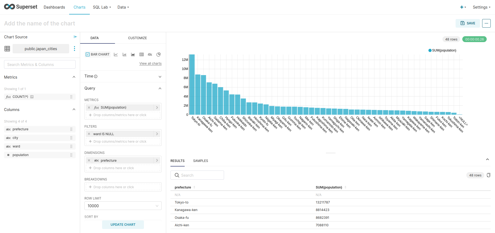
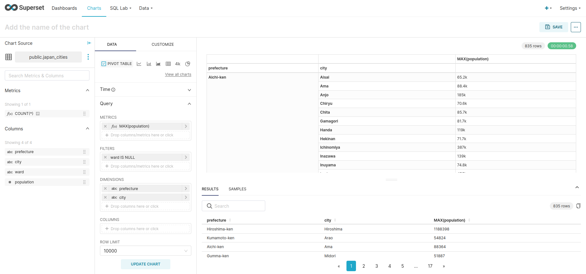
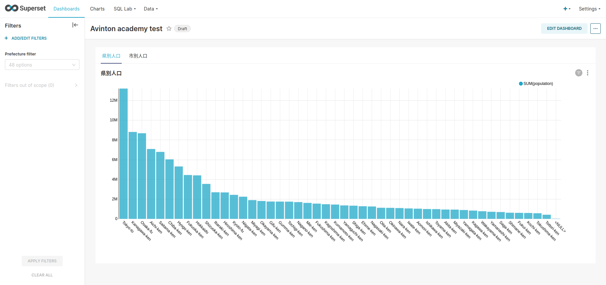

# [Apache Superset 基礎](https://avinton.com/academy/apache-superset-basics/)
## Prerequisite
- [Apache Superset 概要と環境構築](../SettingUp/note.md)

## Result
- Chart Creation 1

- Chart Creation 2

- Dashboard

## Review
- Attach only images of the resultsm, as the explanation is mainly based on images.
- "SERIES" in the article is actually written as "DIMENSIONS"
- "Filter" settings in "Dashboard" appear when dashboard is saved.