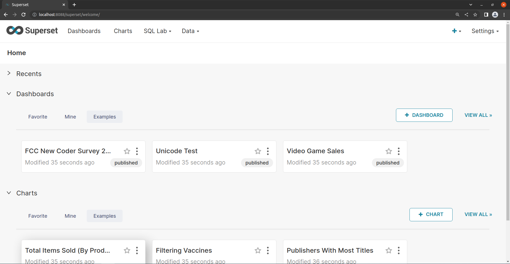

# [Apache Superset 概要と環境構築](https://avinton.com/academy/apache-superset-overview-and-environment-setup/)
## Prerequisite
- [Install Docker Desktop on Ubuntu](https://docs.docker.com/desktop/install/ubuntu/)
```
# Clean up
sudo apt remove docker-desktop
rm -r $HOME/.docker/desktop
sudo rm /usr/local/bin/com.docker.cli
sudo apt purge docker-desktop

# Set up Docker’s package repository.
sudo apt install gnome-terminal
sudo apt-get update
sudo apt-get install ca-certificates curl gnupg lsb-release
sudo mkdir -p /etc/apt/keyrings
curl -fsSL https://download.docker.com/linux/ubuntu/gpg | sudo gpg --dearmor -o /etc/apt/keyrings/docker.gpg
echo "deb [arch=$(dpkg --print-architecture) signed-by=/etc/apt/keyrings/docker.gpg] https://download.docker.com/linux/ubuntu $(lsb_release -cs) stable" | sudo tee /etc/apt/sources.list.d/docker.list > /dev/null

# Download latest DEB package
https://desktop.docker.com/linux/main/amd64/docker-desktop-4.11.0-amd64.deb?utm_source=docker&utm_medium=webreferral&utm_campaign=docs-driven-download-linux-amd64
mv Downloads/docker-desktop-4.11.0-amd64.deb ./

# Install the package with apt as follows
sudo apt-get update
sudo apt-get install ./docker-desktop-4.11.0-amd64.deb
sudo apt istall docker-compose
```

## Procedure
- Install ApacheSuperset
```
git clone -b 1.5.0 https://github.com/apache/superset.git
cd superset
docker-compose -f docker-compose-non-dev.yml up -d
```
- Access ApacheSuperset
```
URL: http://localhost:8088
username: admin
password: admin
```


## Review
- Faced disk space problems. [This](https://avinton.com/academy/extending-virtualbox-virtual-drive/) helped to solve.

