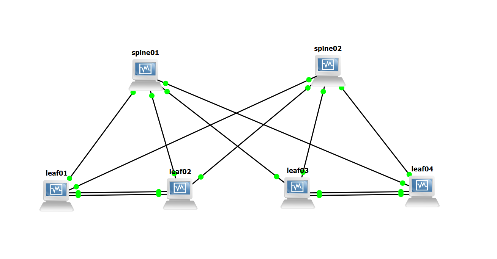
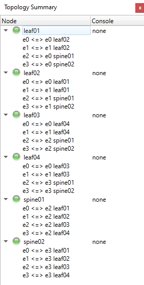

# NVIDIA Cumulus VX + GNS3でBGPネットワークのシミュレーション

## Procedure
1. Download and install [VirtualBox](https://www.virtualbox.org/)
2. Download and install [GNS3](https://www.gns3.com/software)
3. Download the [VirtualBox OVA image](https://www.nvidia.com/en-us/networking/ethernet-switching/cumulus-vx/)
4. Create VMs in VirtualBox  
```
Each Name: leaf01,leaf02,leaf03,leaf04,spine01,spine02
RAM: 1536MB
```

5. Configure GNS3  
- Create a new project
- Enter the location of VBoxManager
```
Path to VBoxManage: C:\Program Files\Oracle\VirtualBox\VBoxManage.exe
```
- Create VirtualBox VM templates
```
Adapters: 4
Type: Paravirtualized Network
CheckBox: Allow GNS3 to use any configured VirtualBox adapter
```

6. Create Network Connections  





7. Log into the Switches  
Log into each switch with the cumulus account and default password cumulus.  
When you log in for the first time, you are prompted to change the default password.  
```
Account: cumulus
password: cumulus
New password: H********3
```

8. Configure BGP
```
# Set hostname
nv set system hostname [leaf01,leaf02,leaf03,leaf04,spine01,spine02]
nv config apply
exit

# configure BGP
## For leaf
nv set interface lo ip address 10.10.10.[1,2,3,4]/32
nv set interface swp1-3,swp49-52
nv set interface bond1 bond member swp1
nv set interface bond2 bond member swp2
nv set interface bond3 bond member swp3
nv set interface bond1 bond mlag id 1
nv set interface bond2 bond mlag id 2
nv set interface bond3 bond mlag id 3
nv set interface bond1-3 bridge domain br_default 
nv set interface peerlink bond member swp49-50
nv config apply

nv set mlag mac-address 44:38:39:BE:EF:AA
nv set mlag backup 10.10.10.[2,1,4,3]
nv set mlag peer-ip linklocal
nv set interface vlan10 ip address 10.1.[10,10,40,40].[2,3,4,5]/24
nv set interface vlan20 ip address 10.1.[20,20,50,50].[2,3,4,5]/24
nv set interface vlan30 ip address 10.1.[30,30,60,60].[2,3,4,5]/24
nv config apply

nv set bridge domain br_default vlan [10,10,40,40],[20,20,50,50],[30,30,60,60]
nv set bridge domain br_default untagged 1
nv set router bgp autonomous-system 6510[1,2,3,4]
nv set router bgp router-id 10.10.10.[1,2,3,4]
nv set vrf default router bgp neighbor swp51 remote-as external
nv set vrf default router bgp neighbor swp52 remote-as external
nv set vrf default router bgp address-family ipv4-unicast network 10.10.10.[1,2,3,4]/32
nv set vrf default router bgp address-family ipv4-unicast redistribute connected
nv config apply


## For spine
nv set interface lo ip address 10.10.10.10[1,2]/32
nv set interface swp1-4
nv set router bgp autonomous-system 65199
nv set router bgp router-id 10.10.10.10[1,2]
nv set vrf default router bgp neighbor swp1 remote-as external
nv set vrf default router bgp neighbor swp2 remote-as external
nv set vrf default router bgp neighbor swp3 remote-as external
nv set vrf default router bgp neighbor swp4 remote-as external
nv set vrf default router bgp address-family ipv4-unicast network 10.10.10.10[1,2]/32
nv config apply

## For All
sudo sed -i 's/bgpd=no/bgpd=yes/' /etc/frr/daemons
sudo systemctl restart frr
sudo ifreload -a
```


## Review
- Refer to [this page](https://docs.nvidia.com/networking-ethernet-software/cumulus-vx/VirtualBox-and-GNS3/)
- Refer to [this page](https://docs.nvidia.com/networking-ethernet-software/cumulus-linux-52/Layer-3/Border-Gateway-Protocol-BGP/Configuration-Example/)
- Refer to [this page](https://docs.nvidia.com/networking-ethernet-software/cumulus-linux-52/Layer-3/Border-Gateway-Protocol-BGP/Troubleshooting/)
- Use Clone to Create VMs faster
