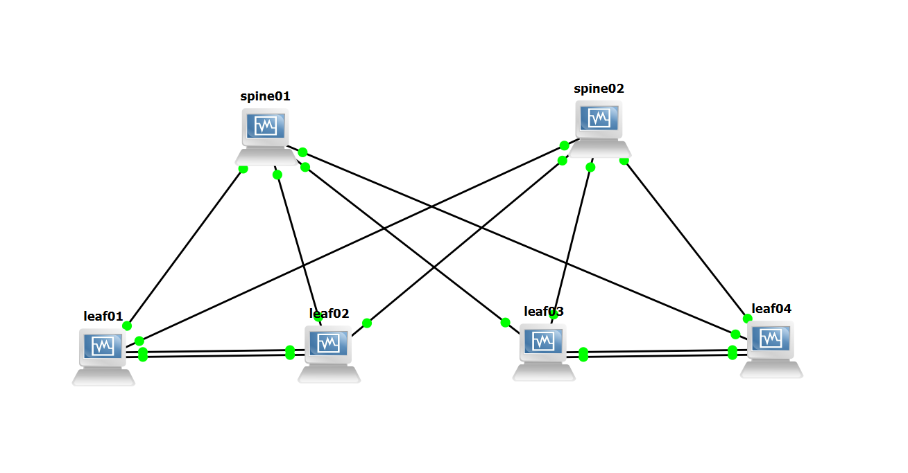
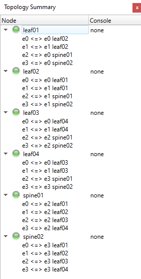

# NVIDIA Cumulus VX + GNS3でBGPネットワークのシミュレーション
## Procedure
1. Download and install [VirtualBox](https://www.virtualbox.org/)
2. Download and install [GNS3](https://www.gns3.com/software)
3. Download the [VirtualBox OVA image](https://www.nvidia.com/en-us/networking/ethernet-switching/cumulus-vx/)
4. Create VMs in VirtualBox  
```
Each Name: leaf01,leaf02,leaf03,leaf04,spine01,spine02
RAM: 1536MB
```

5. Configure GNS3  
- Create a new project
- Enter the location of VBoxManager
```
Path to VBoxManage: C:\Program Files\Oracle\VirtualBox\VBoxManage.exe
```
- Create VirtualBox VM templates
```
Console type: telnet
Adapters: 4
Type: Paravirtualized Network
CheckBox: Allow GNS3 to use any configured VirtualBox adapter
```

6. Create Network Connections  





7. Log into the Switches  
Log into each switch with the cumulus account and default password cumulus.  
When you log in for the first time, you are prompted to change the default password.  
```
Account: cumulus
password: cumulus
New password: H********3
```

8. Configure BGP
- [leaf01](./leaf01/commands.sh)
- [leaf02](./leaf02/commands.sh)
- [leaf03](./leaf03/commands.sh)
- [leaf04](./leaf04/commands.sh)
- [spine01](./spine01/commands.sh)
- [spine02](./spine02/commands.sh)
- For all VMs
```
sudo sed -i 's/bgpd=no/bgpd=yes/' /etc/frr/daemons
sudo systemctl restart frr
sudo ifreload -a
```

## Review
- Refer to [this page](https://docs.nvidia.com/networking-ethernet-software/cumulus-vx/VirtualBox-and-GNS3/)
- Refer to [this page](https://docs.nvidia.com/networking-ethernet-software/cumulus-linux-52/Layer-3/Border-Gateway-Protocol-BGP/Configuration-Example/)
- Refer to [this page](https://docs.nvidia.com/networking-ethernet-software/cumulus-linux-52/Layer-3/Border-Gateway-Protocol-BGP/Troubleshooting/)
- Use Clone to Create VMs faster
- Need to connect to the console to copy and paste