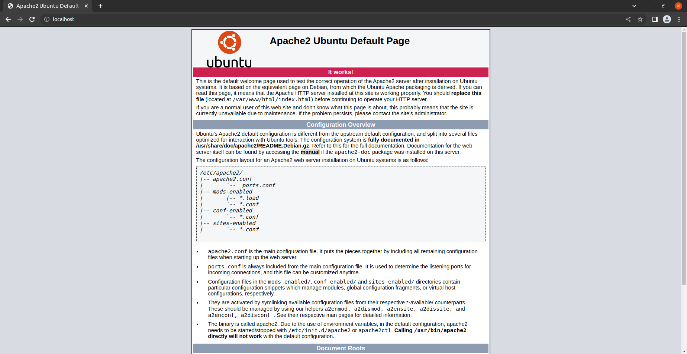
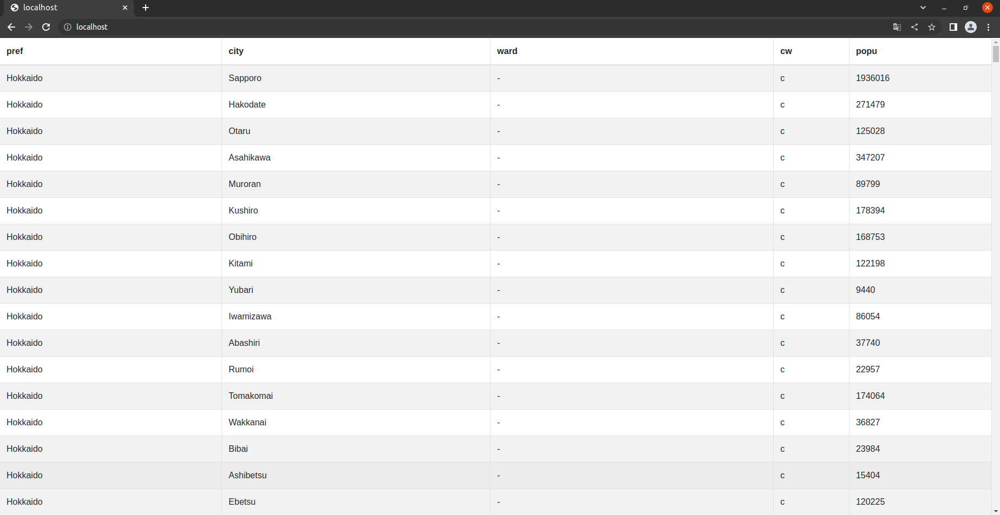

# [PostgreSQL – Python – Apache – Bootstrap](https://avinton.com/academy/postgresql-python-apache-bootstrap/)
## Procedure
- [Install PostgreSQL and pgAdmin](../PostgreSQL/PostgreSQLSetup/note.md)
- Setup Apache
```
sudo apt install apache2
service apache2 status
```


- Sending a query to PostgreSQL in Python
```
# Create Python file
cd; mkdir swa; cd swa; touch swa.py;

# Install module to connect to PostgreSQL
sudo apt-get install python3-pip
sudo apt-get install python3-psycopg2

# Install modules for using Flask
sudo pip install setuptools

# Install Flask (web framework for Python)
sudo pip install Flask

# </etc/postgresql/12/main/pg_hba.conf>
# Database administrative login by Unix domain socket
[-] local all postgres peer

# "local" is for Unix domain socket connections only
[-] local all all peer
[+] local all all trust

# Restart PostgreSQL server
sudo service postgresql stop
sudo service postgresql start
```
- Create a simple web applications
```
# <swa/swa.py>
import sys
import json
import psycopg2
import psycopg2.extensions
psycopg2.extensions.register_type(psycopg2.extensions.UNICODE)
psycopg2.extensions.register_type(psycopg2.extensions.UNICODEARRAY)
 
from flask import Flask  # Import class Flask from module flask
from flask_cors import CORS, cross_origin  #Import flask-cors to accept access to the data
app = Flask(__name__)    # Construct an instance of Flask class
CORS(app)                # apply CORS
 
@app.route('/')   # Register index() as route handler for root URL '/'
def index():
   #Route handler (or View Function) for root URL '/'
   return 'Hello, you have reached the default route for the python endpoint'
 
@app.route('/cities.json')
def cities():
    con = None
    js_string = ''
 
    try:
        con = psycopg2.connect(database='avinton', user='postgres', password='0735', host='127.0.0.1',port='5432')
        cur = con.cursor()
        cur.execute("""
            select
                jsonb_pretty(to_jsonb(array_agg(json_build_object(
                'prefecture', prefecture,
                'city', city,
                'ward', ward,
                'population', population,
                'city_ward', city_ward))))
            from
                japan_cities;
        """)
        
        js_string = str(cur.fetchone()[0])
        print(js_string)
 
    except psycopg2.DatabaseError as e:
        print('DB Error %s' % e)
        sys.exit(1)
 
    finally:
        if con:
            con.close()
 
    return js_string
 
@app.route('/test')
def test():
    return 'test'
 
if __name__ == '__main__':  # Script executed directly?
   app.run()  # Launch built-in web server and run this Flask webapp


# </var/www/html/index.html>
<!DOCTYPE html>
<html lang="ja">
  <head>
    <meta charset="UTF-8">

    <!-- Loading CSS files for Bootstrap -->
    <link rel="stylesheet" 
          href="https://stackpath.bootstrapcdn.com/bootstrap/4.3.1/css/bootstrap.min.css"
          integrity="sha384-ggOyR0iXCbMQv3Xipma34MD+dH/1fQ784/j6cY/iJTQUOhcWr7x9JvoRxT2MZw1T"
          crossorigin="anonymous">
    <link rel="stylesheet" 
          href="https://use.fontawesome.com/releases/v5.6.3/css/all.css"
          integrity="sha384-UHRtZLI+pbxtHCWp1t77Bi1L4ZtiqrqD80Kn4Z8NTSRyMA2Fd33n5dQ8lWUE00s/"
          crossorigin="anonymous">
    <link rel="stylesheet" 
          href="https://unpkg.com/bootstrap-table@1.19.1/dist/bootstrap-table.min.css">
  </head>

    <!-- Loading javascript files for Bootstrap -->
    <script src="https://cdn.jsdelivr.net/npm/jquery/dist/jquery.min.js"></script>
    <script src="https://cdn.jsdelivr.net/npm/popper.js@1.16.0/dist/umd/popper.min.js"></script>
    <script src="https://stackpath.bootstrapcdn.com/bootstrap/4.3.1/js/bootstrap.min.js" 
            integrity="sha384-JjSmVgyd0p3pXB1rRibZUAYoIIy6OrQ6VrjIEaFf/nJGzIxFDsf4x0xIM+B07jRM" 
            crossorigin="anonymous"></script>
    <script src="https://unpkg.com/bootstrap-table@1.19.1/dist/bootstrap-table.min.js"></script>

  <body>
  
    <!-- Display Table -->
    <table data-toggle="table" 
           data-url="http://127.0.0.1:5000/cities.json"
           class="table table-hovor table-striped table-condensed">

      <thead>
        <tr>
          <th data-field="prefecture">pref</th>
          <th data-field="city">city</th>
          <th data-field="ward">ward</th>
          <th data-field="city_ward">cw</th>
          <th data-field="population">popu</th>
        </tr>
      </thead>
    </table>
  </body>
</html>
```


# Review
- It will also be necessary to delete the cache before opening the page