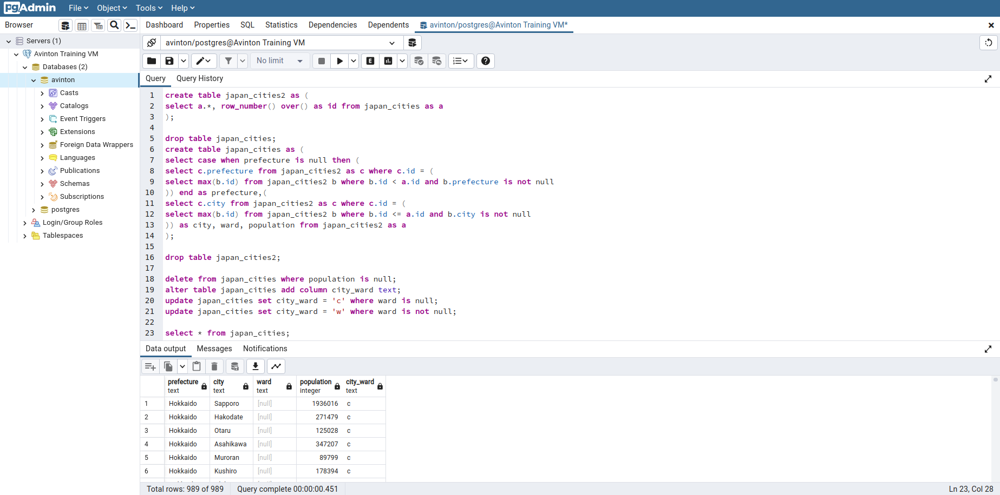

# [PostgreSQLによるデータ分析](https://avinton.com/academy/)
```
# Data loading
cd /var/tmp/
wget http://avinton.com/wp-content/uploads/2016/07/japan_cities.tsv
sudo su postgres
psql -d avinton
create table japan_cities (prefecture text, city text, ward text, population integer);
copy japan_cities from '/var/tmp/japan_cities.tsv' NULL 'NULL';
\q

# Data formatting (@pgAdmin)
create table japan_cities2 as (
select a.*, row_number() over() as id from japan_cities as a
);
 
drop table japan_cities;
create table japan_cities as (
select case when prefecture is null then (
select c.prefecture from japan_cities2 as c where c.id = (
select max(b.id) from japan_cities2 b where b.id < a.id and b.prefecture is not null
)) end as prefecture,(
select c.city from japan_cities2 as c where c.id = (
select max(b.id) from japan_cities2 b where b.id <= a.id and b.city is not null
)) as city, ward, population from japan_cities2 as a
);
 
drop table japan_cities2;
 
delete from japan_cities where population is null;
alter table japan_cities add column city_ward text;
update japan_cities set city_ward = 'c' where ward is null;
update japan_cities set city_ward = 'w' where ward is not null;
 
select * from japan_cities;
```


```
# Exercise
## Most populous district
SELECT ward
FROM japan_cities 
WHERE city_ward = 'w'
ORDER BY population DESC
LIMIT 1;

## Standard deviation of city population
SELECT stddev(population)
FROM japan_cities
WHERE city_ward = 'c';

## Number of cities in Hokkaido
SELECT count(*)
FROM japan_cities
WHERE prefecture = 'Hokkaido' AND city_ward = 'c';

## Total number of wards in Japan
SELECT count(*)
FROM japan_cities
WHERE city_ward = 'w';

## Names of prefectures and their populations
SELECT prefecture, sum(population)
FROM japan_cities
WHERE city_ward = 'c'
GROUP BY prefecture;

## Population of each prefecture in descending order
SELECT *
FROM (
    SELECT sum(population) AS popu
    FROM japan_cities
    WHERE city_ward = 'c'
    GROUP BY prefecture
) AS unsort
ORDER BY unsort.popu DESC;

## Name of each prefecture and the most populated city in the prefecture
SELECT prefecture, city
FROM japan_cities NATURAL INNER JOIN (
    SELECT prefecture, max(population) AS population
    FROM japan_cities
    WHERE city_ward = 'c'
    GROUP BY prefecture
) AS a;


## Name of each city and the prefecture to which it belongs, the least and most populated wards, and the total population of the city, on one line for each city
SELECT DISTINCT
    city,
    prefecture,
    min(population) 
	FILTER (WHERE city_ward = 'w')
	OVER (PARTITION BY city),
    max(population)
	FILTER (WHERE city_ward = 'w')
	OVER (PARTITION BY city),
    max(population)
	OVER (PARTITION BY city)
FROM japan_cities;
```
