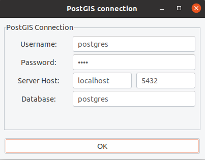
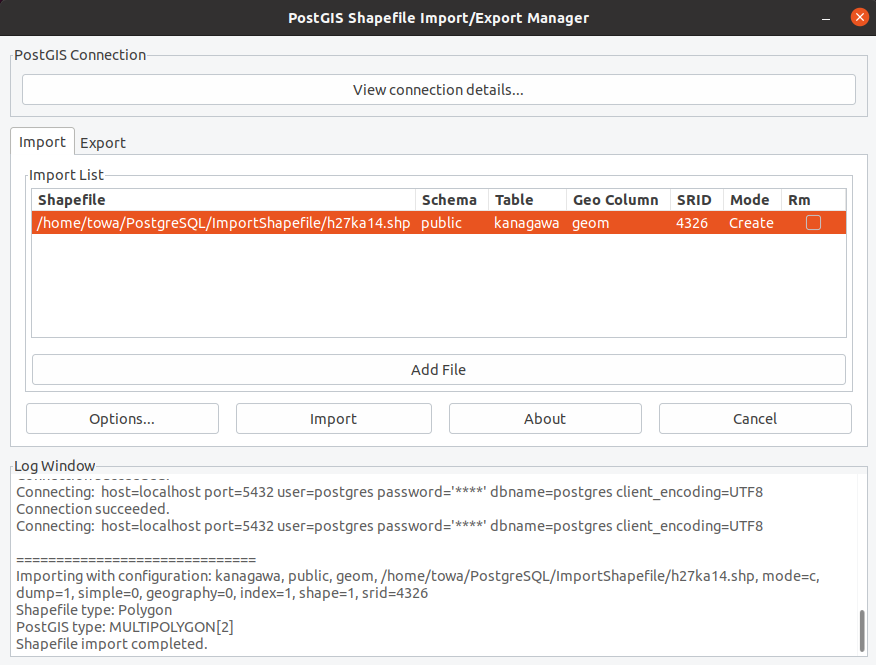

# [postgreSQLへのshp fileのimport](https://avinton.com/academy/importing-shp-files-to-postgresql/)
## Procedure
1. [Install PostgreSQL and pgAdmin](../PostgreSQLSetup/note.md)
2. Download [Kanagawa Prefecture-wide shapefile](https://www.e-stat.go.jp/gis/statmap-search?page=1&type=2&aggregateUnitForBoundary=A&toukeiCode=00200521&toukeiYear=2015&serveyId=A002005212015&prefCode=14&coordsys=1&format=shape)
3. Enable PostGIS
```
# Install PostGIS
sudo apt update & sudo apt install postgis

# Access Postgres prompt
sudo su postgres
psql

# Enable PostGIS
CREATE EXTENSION postgis;
\q
```

### Import with command
4. Import Shapefile
```
# Convert Shapefile to PostgreSQLfile
shp2pgsql -s 4612:4326 h27ka14.shp public.kanagawa > test.sql

# Import
psql -d postgres -f test.sql

# @pgAdmin > Query Editor
SELECT *
FROM public.kanagawa
```


### Import with GUI
4. Import Shapefile
```
sudo apt install postgis-gui
shp2pgsql-gui

# [View connection details..] > Edit > [OK] > [Add File] > [h27ka14.shp] > Edit > [Import]
```





## Review
- The execution result was slightly different from what was displayed on the web page, but it was considered to be done.
- Faced error when importing via GUI ([StackOverflow](https://stackoverflow.com/questions/44618374/error-function-addgeometrycolumn-does-not-exist-when-trying-to-import-file-int))
```
Connecting:  host=localhost port=5432 user=postgres password='****' dbname=avinton client_encoding=UTF8

==============================
Importing with configuration: kanagawa, public, geom, /home/towa/PostgreSQL/ImportShapefile/h27ka14.shp, mode=c, dump=1, simple=0, geography=0, index=1, shape=1, srid=4326
Shapefile type: Polygon
PostGIS type: MULTIPOLYGON[2]
Failed SQL begins: "SET CLIENT_ENCODING TO UTF8;
SET STANDARD_CONFORMING_STRINGS TO ON;
BEGIN;
CREATE TABLE "public"."kanagawa" (gid serial,
"key_code" varchar(11),
"pref" varchar(2),
"city" varchar(3),
"s_area" varchar(6),
"pref_name" varchar(12),
"city_
Failed in pgui_exec(): ERROR:  function addgeometrycolumn(unknown, unknown, unknown, unknown, unknown, integer) does not exist
LINE 41: SELECT AddGeometryColumn('public','kanagawa','geom','4326','...
                ^
HINT:  No function matches the given 
Shapefile import failed.
```