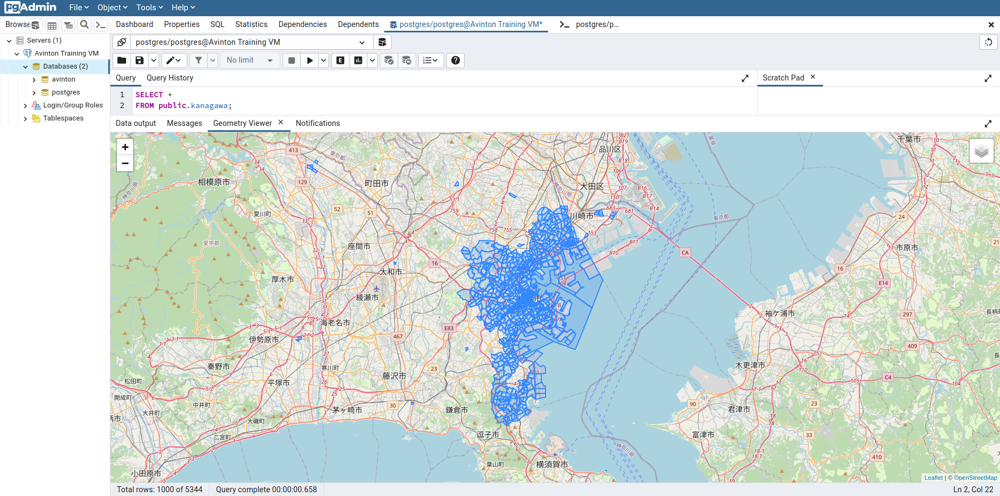

# [postgreSQLへのshp fileのimport](https://avinton.com/academy/importing-shp-files-to-postgresql/)
## Procedure
1. [Install PostgreSQL and pgAdmin](../PostgreSQLSetup/note.md)
2. Download [Kanagawa Prefecture-wide shapefile](https://www.e-stat.go.jp/gis/statmap-search?page=1&type=2&aggregateUnitForBoundary=A&toukeiCode=00200521&toukeiYear=2015&serveyId=A002005212015&prefCode=14&coordsys=1&format=shape)
3. Enable PostGIS
```
# Install PostGIS
sudo apt update & sudo apt install postgis

# Access Postgres prompt
sudo su postgres
psql

# Enable PostGIS
CREATE EXTENSION postgis;
\q
```

### Import with command
4. Import Shapefile
```
# Convert Shapefile to PostgreSQLfile
shp2pgsql -s 4612:4326 h27ka14.shp public.kanagawa > test.sql

# Import
psql -d postgres -f test.sql

# @pgAdmin > Query Editor
SELECT *
FROM public.kanagawa
```


### Import with GUI
- Pending whether to do it or not.

## Review
- The execution result was slightly different from what was displayed on the web page, but it was considered to be done.