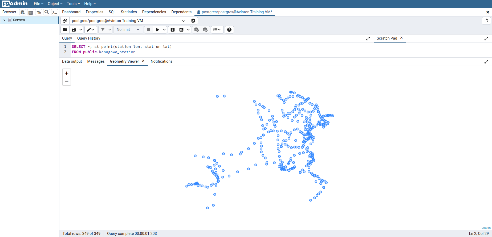

# [PostGIS exercise](https://avinton.com/academy/postgis-exercise/)
## Prerequisite
- [PostgreSQL Setup](../PostgreSQLSetup/note.md)  
- [postgreSQLへのshp fileのimport](../ImportShapefile/note.md)

## Procedure
1. Import files containing station names and their locations in Kanagawa Prefecture into PostgreSQL
```
# @Terminal
wget https://avinton.com/wp-content/uploads/2022/04/kanagawa_stations.csv
sudo su postgres
psql -d postgres
create table public.kanagawa_station (station_code text, station_name text, station_lat real, station_lon real);
copy public.kanagawa_station from '/home/towa/PostgreSQL/PostGISExercise/kanagawa_stations.csv' csv header encoding 'SJIS';
```

2. Execute some Query ([PostGIS](https://postgis.net/docs/ST_Within.html))
```
# @pgAdmin > [Query tool]
## Plot with latitude and longitude information
SELECT *, st_point(station_lon, station_lat)
FROM public.kanagawa_station;
```


```
## Plot station locations on a map by specifying SRIDs
SELECT *, ST_SetSRID(ST_Point(station_lon, station_lat), 4326)
FROM public.kanagawa_station;
```


```
## Combines station information with geographic information
SELECT A.station_code, 
       A.station_name, 
	   A.station_lat, 
	   A.station_lon,
	   B.ken_name,
       B.gst_name,
       B.css_name,
       B.moji
FROM public.kanagawa_station as A
JOIN public.kanagawa as B
ON ST_Within(ST_SetSRID(ST_Point(A.station_lon, A.station_lat),4326), B.geom);
```


## Review
- Change database to create tables (avinton → postgres)