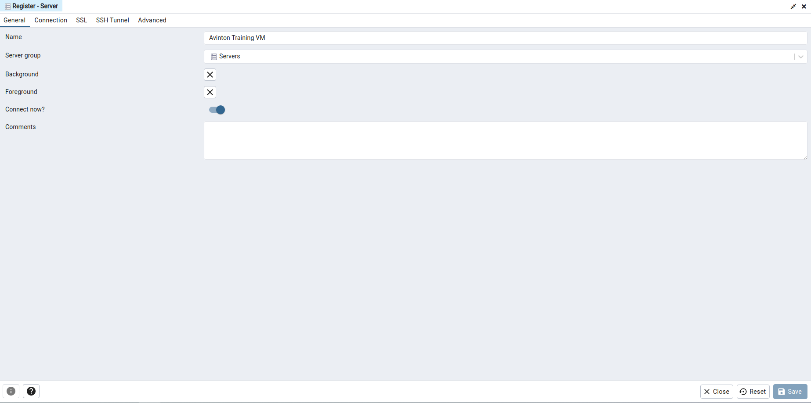
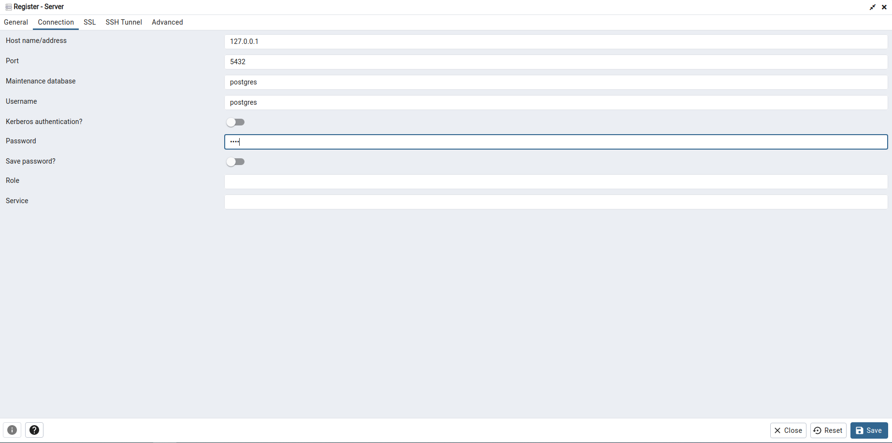

# [PostgreSQL Setup](https://avinton.com/academy/postgresql-setup/)
```
# Install PostgreSQL
sudo apt install postgresql postgresql-contrib

# Configure server
sudo -u postgres psql postgres # Login PostgreSQL server
\password postgres
\q

# Create Database
sudo -u postgres createdb avinton

# Configure remote access
## </etc/postgresql/12/main/pg_hba.conf

# IPv4 local connections:
[+] host all all samenet password

## </etc/postgresql/12/main/postgresql.conf>

# - Connection Settings -
[+] listen_addresses = '*'

# Reboot PostgreSQL server
service postgresql stop
service postgresql start
service postgresql status

# result
● postgresql.service - PostgreSQL RDBMS
     Loaded: loaded (/lib/systemd/system/postgresql.service; enabled; v>
     Active: active (exited) since Thu 2022-08-18 00:32:09 PDT; 25s ago
    Process: 3116 ExecStart=/bin/true (code=exited, status=0/SUCCESS)
   Main PID: 3116 (code=exited, status=0/SUCCESS)
   ...

# Install pgAdmin
sudo curl https://www.pgadmin.org/static/packages_pgadmin_org.pub | sudo apt-key add
sudo sh -c 'echo "deb https://ftp.postgresql.org/pub/pgadmin/pgadmin4/apt/$(lsb_release -cs) pgadmin4 main" > /etc/apt/sources.list.d/pgadmin4.list && apt update'
sudo apt install pgadmin4

# Open pgAdmin and Add New Server
```

